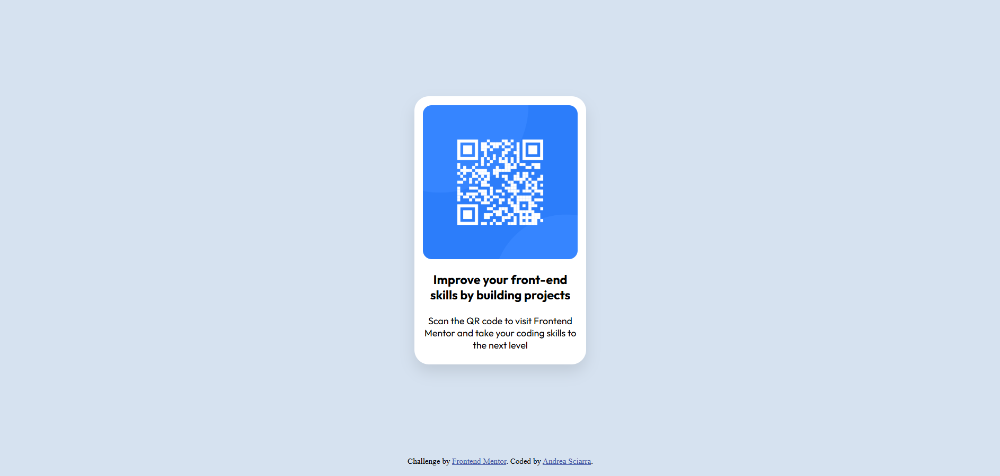

# Frontend Mentor - QR code component solution

This is a solution to the [QR code component challenge on Frontend Mentor](https://www.frontendmentor.io/challenges/qr-code-component-iux_sIO_H). Frontend Mentor challenges help you improve your coding skills by building realistic projects. 

## Table of contents

- [Overview](#overview)
  - [Screenshot](#screenshot)
  - [Links](#links)
- [My process](#my-process)
  - [Built with](#built-with)
- [Author](#author)

## Overview

### Screenshot

### Links

- Solution URL: [solution URL](https://github.com/andreasci/QRCode/)
- Live Site URL: [live site URL](https://andreasci.github.io/QRCode/)

## My process

### Built with

- Semantic HTML5 markup
- CSS custom properties
- Flexbox
- Nested divs
- Desktop-first workflow

## Author

- Website - [GitHub profile](https://github.com/andreasci)
- Frontend Mentor - [Frontend Mentor profile](https://www.frontendmentor.io/profile/andreasci)